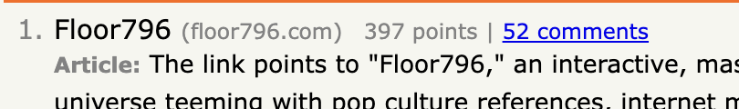

# HN-Brief

AI-powered daily summaries of Hacker News stories and discussions.

## Features

- **Article Mode**: Per-story summaries with article + discussion breakdown
- **Digest Mode**: All stories summarized into one cohesive narrative
- **Daily Archive**: Browse summaries from previous days via calendar picker
- **HN Aesthetic**: Classic Hacker News styling with Verdana font
- **Zero Framework**: Pure HTML/CSS/JS frontend

## Quick Start

### Prerequisites
- [Bun](https://bun.sh/) (v1.0+)
- API key for summarization (OpenRouter or OpenAI-compatible)

### Installation

```bash
# Clone the repository
git clone https://github.com/jnd0/hn-brief.git
cd hn-brief

# Install dependencies
bun install

# Copy environment variables
cp .env.example .env
# Edit .env with your API keys
```

### Run Locally

```bash
# Serve the static site
bunx serve .
```
Visit `http://localhost:3000`

### Generate Summaries

```bash
# Generate today's summaries (Article + Digest modes)
bun run summarize

# Show all CLI options
bun run summarize -- --help
```

#### CLI Options

| Option | Short | Description |
|--------|-------|-------------|
| `--date <YYYY-MM-DD>` | `-d` | Run for a specific date (default: today) |
| `--articles` | `-a` | Generate only article summaries |
| `--digest` | `-g` | Generate only digest summary |
| `--help` | `-h` | Show help message |

#### Examples

```bash
# Generate both modes for today
bun run summarize

# Generate for a specific date
bun run summarize -- --date 2025-12-25

# Generate only articles
bun run summarize -- --articles

# Generate only digest for a specific date
bun run summarize -- -d 2025-12-25 -g
```


## Environment Variables

| Variable | Description | Required |
|----------|-------------|----------|
| `OPENROUTER_API_KEY` | OpenRouter API key (recommended) | Yes (or one of below) |
| `OPENROUTER_MODEL` | OpenRouter model to use | No |
| `OPENAI_API_KEY` | OpenAI-compatible API key | Yes (or another key) |
| `GITHUB_TOKEN` | GitHub PAT for automated commits | For Worker only |
| `REPO_OWNER` | GitHub username | For Worker only |
| `REPO_NAME` | Repository name | For Worker only |


## Project Structure

```
hn-brief/
├── index.html          # Frontend (Article/Digest toggle)
├── assets/
│   ├── style.css       # HN-style CSS
│   ├── app.js          # Frontend JavaScript
│   └── favicon.png     # Site favicon
├── pages/
│   ├── faq.html        # FAQ page
│   └── about.html      # About page
├── scripts/
│   └── summarizer.ts   # Bun script for local generation
├── worker/
│   ├── index.ts        # Cloudflare Worker
│   └── wrangler.jsonc  # Worker config
└── summaries/          # Generated summaries (organized by year/month)
    ├── archive.json    # Index of available dates (see below)
    └── YYYY/
        └── MM/
            ├── DD.md
            └── DD-digest.md
```

### archive.json

The `archive.json` file is a manifest that tells the frontend which dates have summaries:

```json
[
  { "date": "2025-12-27", "hasDigest": true, "storyCount": 20 },
  { "date": "2025-12-26", "hasDigest": true, "storyCount": 20 }
]
```

**Why it exists:** Static sites can't list directory contents, so the calendar UI needs this index to know which dates are clickable. It's auto-updated by the summarizer when generating new summaries.

## Contributing

See [CONTRIBUTING.md](CONTRIBUTING.md) for guidelines.

## License

MIT
